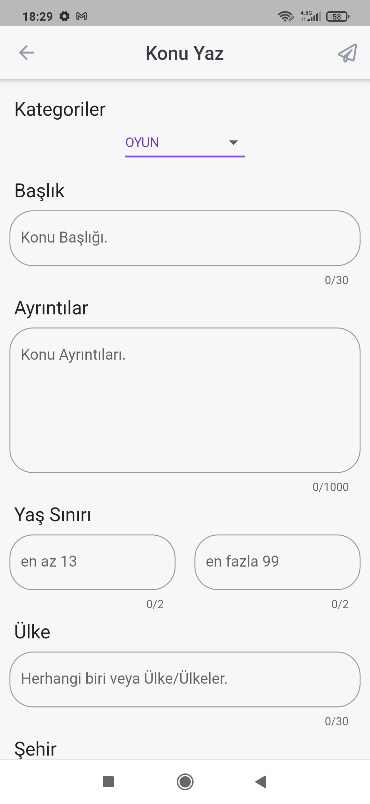
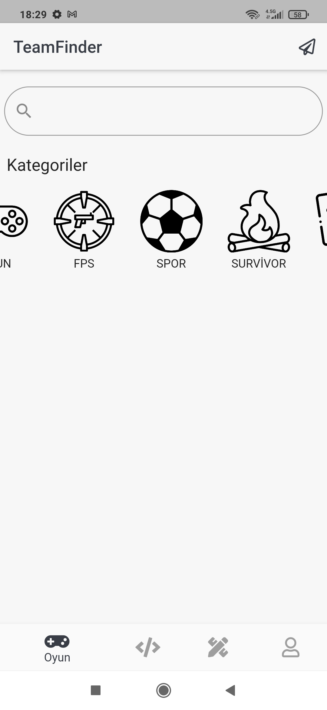
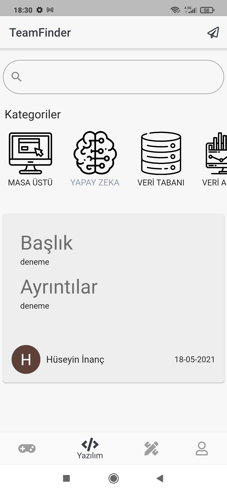
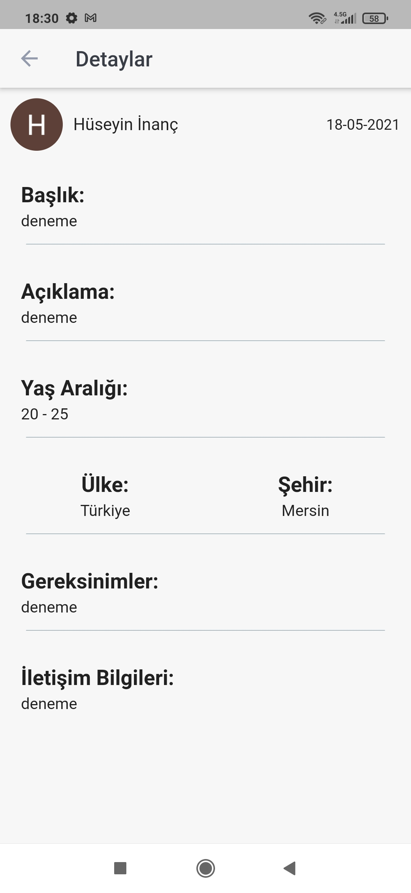

# TeamFinder

FireBase öğrenimim için geliştirmiş olduğum takım arkadaşı bulma uygulaması.

## Kullanım şekli

Uygulama içerisinde herhangi bir kategoride istediğimiz kriterlerdeki takım arkadaşını konu yaz kısmında belirtiyoruz ve daha sonra bir post olarak atıyoruz.
Bu postu gören kişilerde belirlelen kriterlerde ise konu içerisinde yazılı olan iletişim bilgileri kısmında postu atan kişiye ulaşarak takım arkadaşı olmaları sağlanıyor.
İletişim bilgisi olarak email, facebook, twitter, instagram, vb. sosyal medya profilleri belirlenebilir.

## Screenshots
        
        
        
